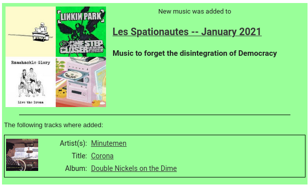

This daemon allows to get notifications about songs added to Spotify
playlists as an html email.



Installation
------------

This explains how to set this up to run as a systemd daemon.

Clone the repository to an appropriate folder, e.g. in `/opt`. Run the
`./install.sh <python-executable>` script. This will setup a virtual
environment and install all the required packages. You must provide
the python executable with a version >= 3.7 that you want to use to
run the program. At the end of the output you will be given a path to
an executable. For this you have to use to adapt the
`spotify_notify_playlist_update.service` template. The template itself
should be self-explanatory. Copy the resulting file to
`/etc/systemd/system/`. Now it is possible to start/stop the service
with the commands

```
sudo systemctl [start|stop|restart|status] spotify_notify_playlist_update.service
```

To make it run at startup execute

```
sudo systemctl enable spotify-notify-playlist-update.service
```

Configuration
-------------

After running it for the first time an empty SQLite database `data.db`
will have been started in the installation folder. The following
tables must be configured to set up updates for a playlist:

- `connection_credentials`: Here you can configure different
  connections to Spotify accounts via client secrets. You can
  configure an app and get a client secret
  [here](https://developer.spotify.com/dashboard/applications). You
  need to give the app the `playlist-read-collaborative` permission.
  Copy paste the Client ID and the Client Secret into the field
  `client_id` and `client_secret` respectively.
- `global_config`: Here there should be a single row. You need to set
  all the information to connect to an email account. This will be
  used to send notification emails. Best would be create a throwaway
  account for this.
- `playlists`: To configure a new playlist the copy 'Spotify URI'
  (this can be copied in the 'share' option of the playlist on the
  Spotify UI) into the field `spotify_playlist_id` and set
  `connection_id` to the `id` field of the entry in the
  `connection_credentials` table which contains credentials that can
  be used to acces this playlist. The field `last_state_json` should
  be left as `NULL`.
- `members`: Here you can configure the people who can be a linked to
  receive updates to a playlist. it contains the following fields:
  - `name`: The name of the member.
  - `spotify_user_id`: This should be set to the Spotify URI of the
    user, which can be copied by selecting share for a user on the
    Spotify UI.
  - `email`: The email address to which notifications should be sent.
- `groups`: Here groups can be defined by simple giving them a new in
  the `name` field. The name can be anything descriptive enough.
- `group_members`: Here every row with a pair of `group_id` and
  `member_id` adds the member represented by the entry of the table
  `members` where `members.id = group_members.member_id` to the group
  in the table `groups` where `groups.id = group_members.group_id`.
- `playlist_groups`: This table connects playlist to groups. Every
  group connected to an updated playlist will be notified. Here every
  row with a pair of `group_id` and `playlist_id` adds the group
  represented by the entry of the table `groups` where `groups.id =
  playlist_group.member_id` to the playlist in the table `playlists`
  where `playlists.id = playlist_groups.group_id`.
